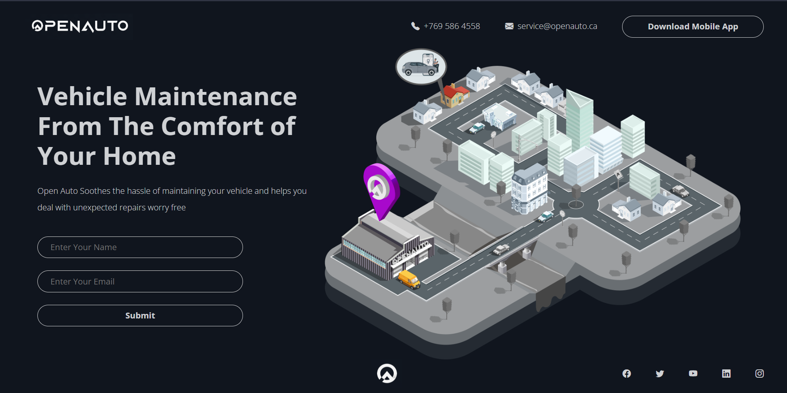
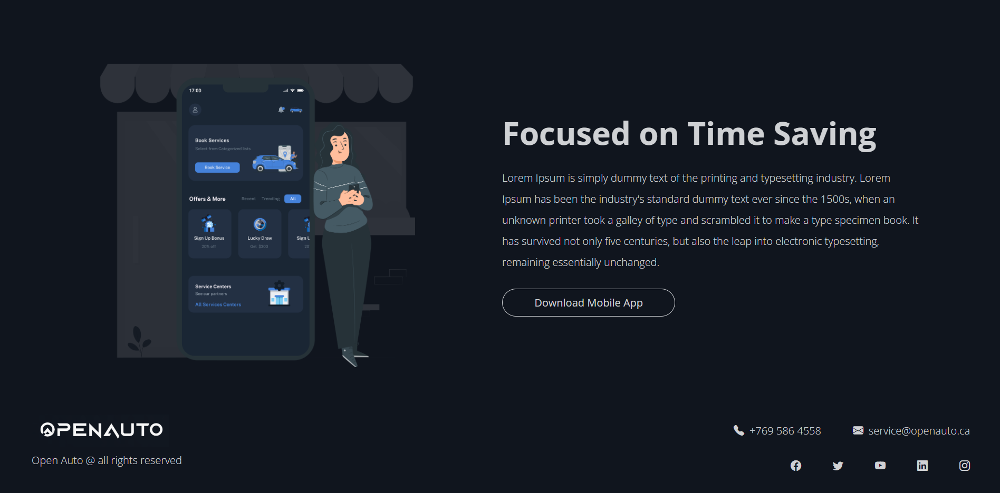

# OPENAUTO LANDING PAGE

* ReactJS Frontend (```NextJS``` Framework).
* ```Bootstrap``` framework for styling and responsive design.
* ```MongoDB Atlas``` used for storing user information from the form.


<br/>
